> 下面内容均为功能操作详细展示

## 树节点操作

双击 `TREE.exe` 打开程序，根据提示进行树的创建，点击**“创建新树”**，在**“树名”**输入树名*（例：计算机）*，如图，树创建成功。

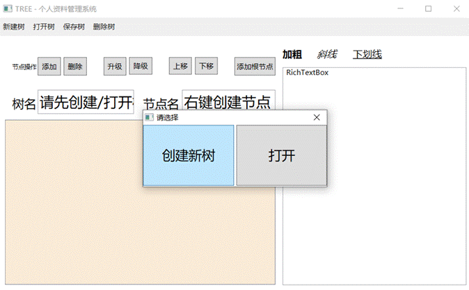

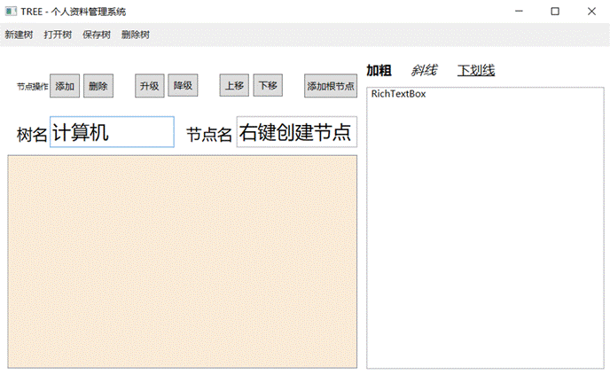

### 节点新建/删除/改名

#### 节点新建

在**“节点操作”**处点击**“添加根节点”**，在**“节点名”**处输入根节点名，*（例：文件管理）*，如图，根节点创建成功。

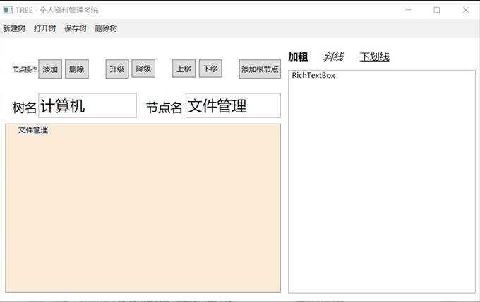

选择一个父节点，单击该节点，在**“节点操作”**处点击**“添加”**，或者右击该节点选择**“添加”**进行其子节点的创建*（例 ：在文件管理下添加文件夹 1、文件夹 2）*，如图，添加子节点成功。

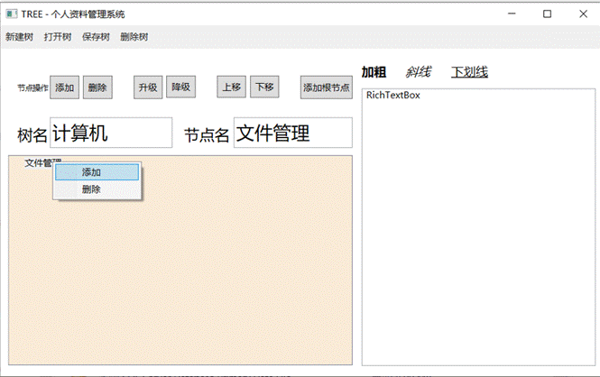

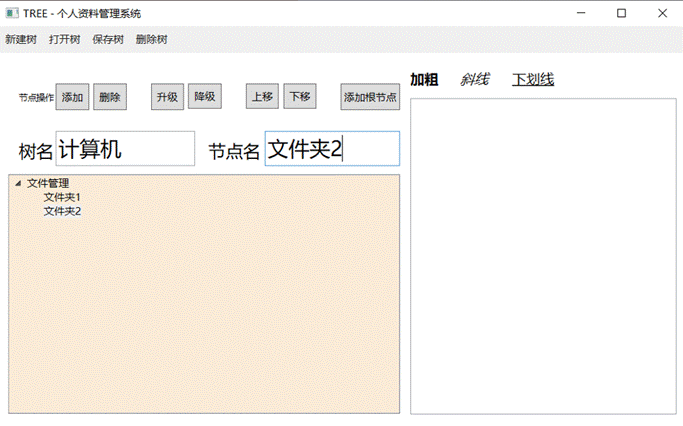

#### 节点删除

选择要删除的节点，单击该节点，在**“节点操作”**处点击**“删除”**，或者右击该节点选择**“删除”**进行节点的删除*（例 ：删除文件夹 4）*，如图，删除子节点成功。

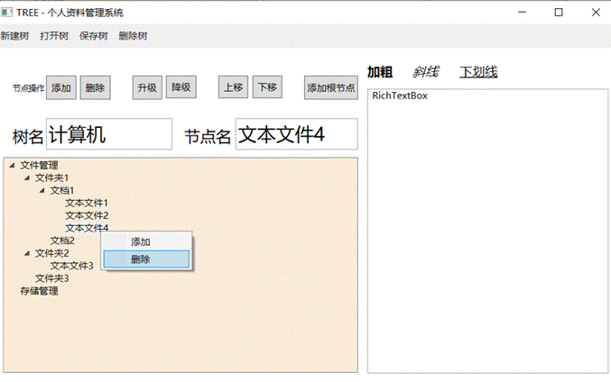

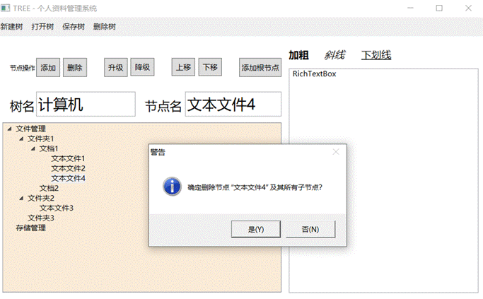

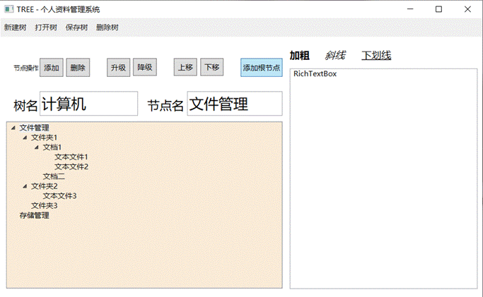

#### 节点改名

选择要改名的节点，单击该节点，在**“节点名”**处输入要改动的名字*（例 ：将编辑功能改为输入功能）*，如图，节点改名成功。

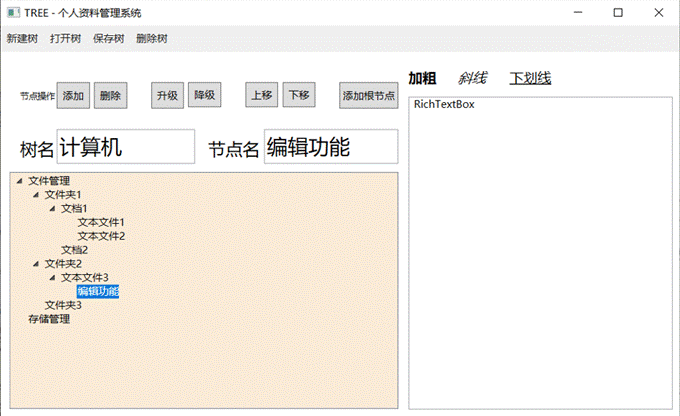

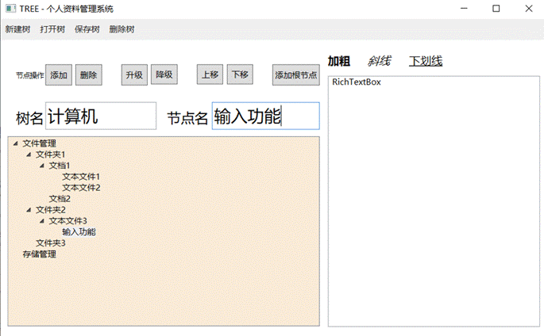

### 节点升级

选择要升级的节点，单击该节点，在**“节点操作”**处点击升级*（例 ：将文本文件 2升级）*，如图，节点升级成功。

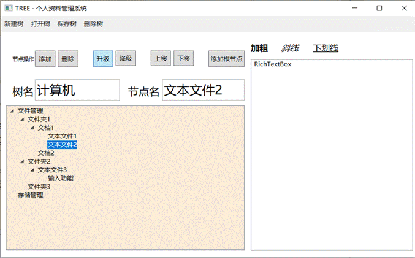

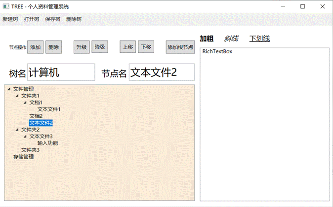

### 节点降级

选择要降级的节点，单击该节点，在**“节点操作”**处点击降级*（例 ：将文本文件 2 降级）*，如图，节点降级成功。

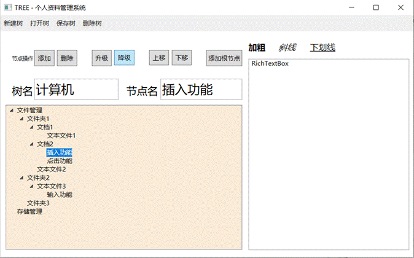

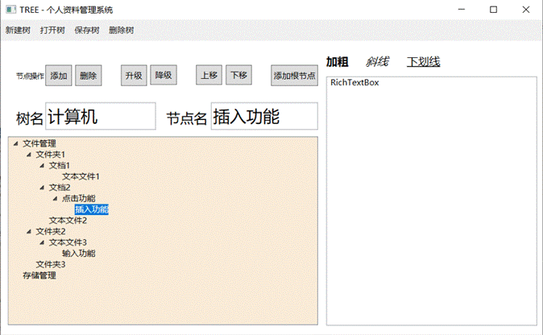

### 节点上移

选择要上移的节点，单击该节点，在**“节点操作”**处点击上移*（例 ：将文档 2 上移）*，如图，节点上移成功。

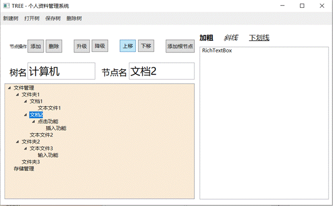

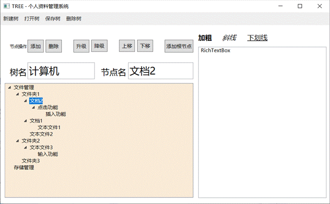

### 节点下移

选择要下移的节点，单击该节点，在**“节点操作”**处点击下移*（例 ：将文件夹 1下移）*，如图，节点下移成功。

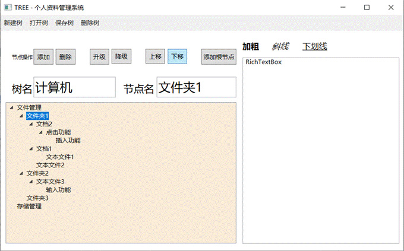

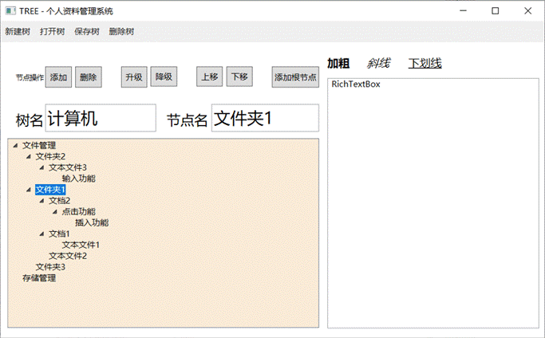

## 信息的编辑

### 节点相关联信息的显示与基础编辑功能

选择要编辑内容的节点，**双击**该节点，右边文本框则会显示该节点的关联信息，也可以直接在右边文本文本框输入编辑内容*（例：在文件夹 1中添加编辑内容）*，如图,内容显示、编辑成功。

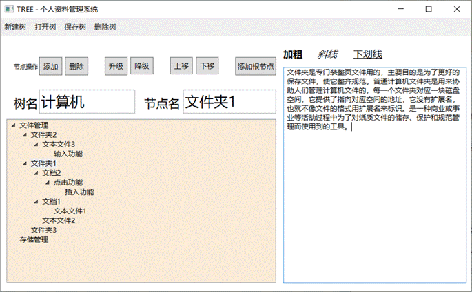

### 辅助功能

#### 加粗

在右边文本框显示的信息中选择要加粗的内容，点击**“加粗”**，如图，内容加粗成功。

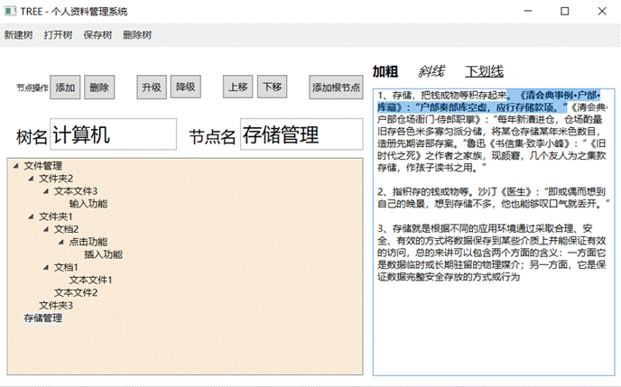

#### 斜线

在右边文本框显示的信息中选择要进行斜线的内容，点击**“斜线”**，如图，内容斜线成功。

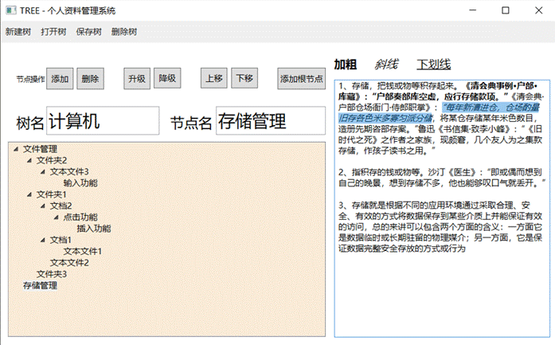

#### 下划线

在右边文本框显示的信息中选择要加下划线的内容，点击**“下划线”**，如图，操作成功。

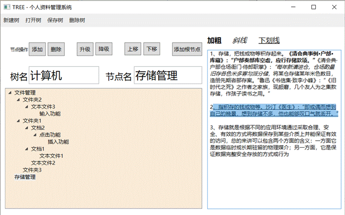

